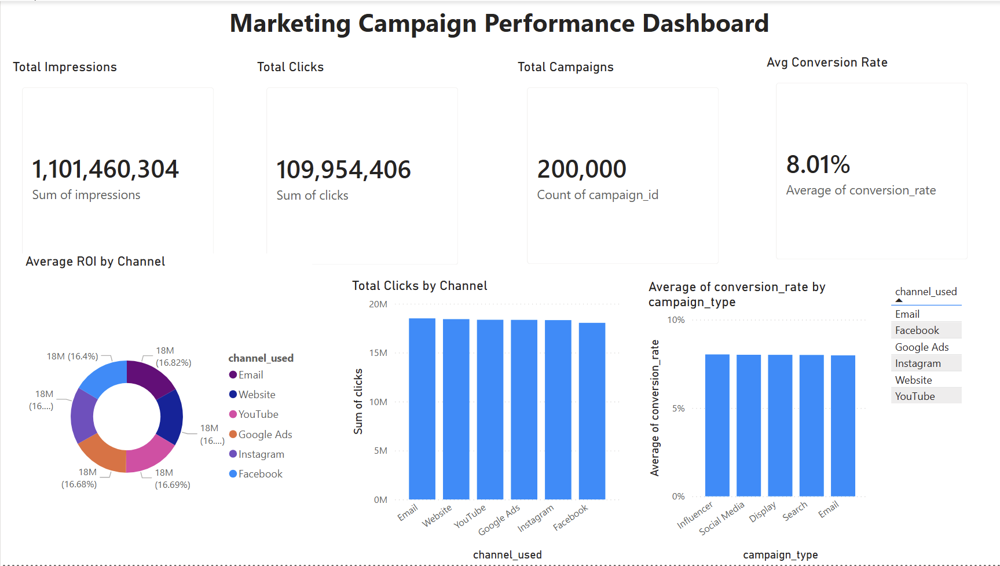

**Marketing Campaign Performance Analysis**

Project Overview (STAR Method)

**Situation**
The aim of this project was to analyse a large marketing dataset (200,000 rows) and to review the effectiveness of marketing campaigns across different digital channels. The data was stored in a Supabase (PostgreSQL) cloud database, with a live connection needed to Power BI for real-time reporting and visualisation of key metrics such as ROI and CTR. 

**Task**
My goal was to build an interactive dashboard and design an end-to-end data pipeline that would:

Create a secure, encrypted connection between the cloud database and Power BI.
Use SQL to collect data and obtain useful information.
Create an interactive dashboard to identify high-performing channels and campaign types.

**Action**
Infrastructure & Security: Overcame a critical "Remote Certificate Invalid" error by manually setting up the SSL handshake. This included downloading the Supabase CA certificate and importing that certificate into the Windows Trusted Root Certification Authorities to create a secure and encrypted data bridge.

SQL Engineering: Wrote optimised SQL queries to determine performance ratios. I used the NULLIF function to overcome the possible "division by zero" and CAST operators for accurate decimal calculations.

Data Visualisation: Developed a detailed Power BI Dashboard highlighting:

KPI Scorecards for high volume metrics (1.1B+ Impressions).
Donut and histogram Visuals to compare ROI and click volume of the different channels
Interactive Slicers that allow filtering by Campaign Type and Date.

**Result**
The project provided a "live" reporting tool, which uncovered a steady 5.0 ROI across all channels. This proved that the current marketing mix is balanced and that the costs of acquisition are sustainable, which will give the team the data needed to scale budgets with confidence.

**Technical Toolkit**
Database: Supabase (PostgreSQL)
Query Language: SQL (PostgreSQL)
BI Tool: Power BI
Skills: SSL/Security Configuration, Data Modelling, DAX, Dashboard Design

**Project Structure** 
**[SQL Scripts](./sql-scripts/):** Contains cleaned and analysed queries.
**[Power BI File](./marketing_campaign_dashboard.pbix):** The dashboard file (Download to view).

**Dashboard Preview**

